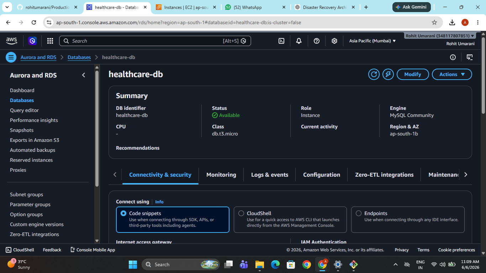
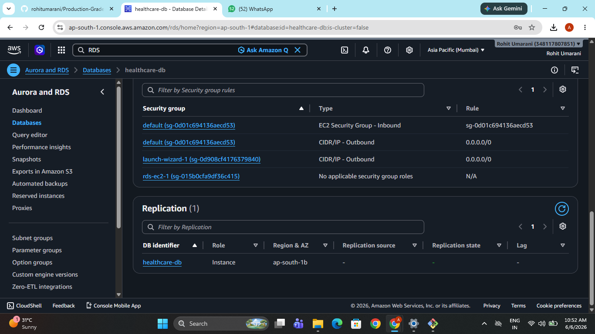
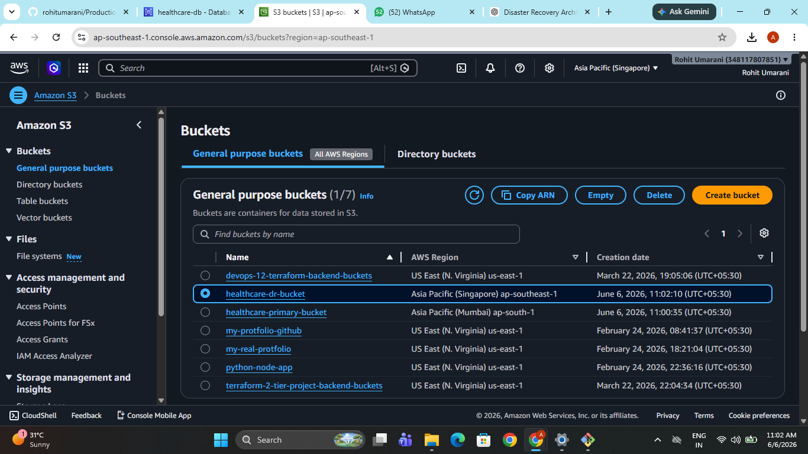
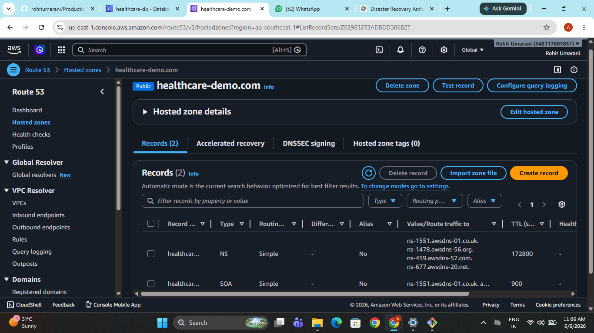
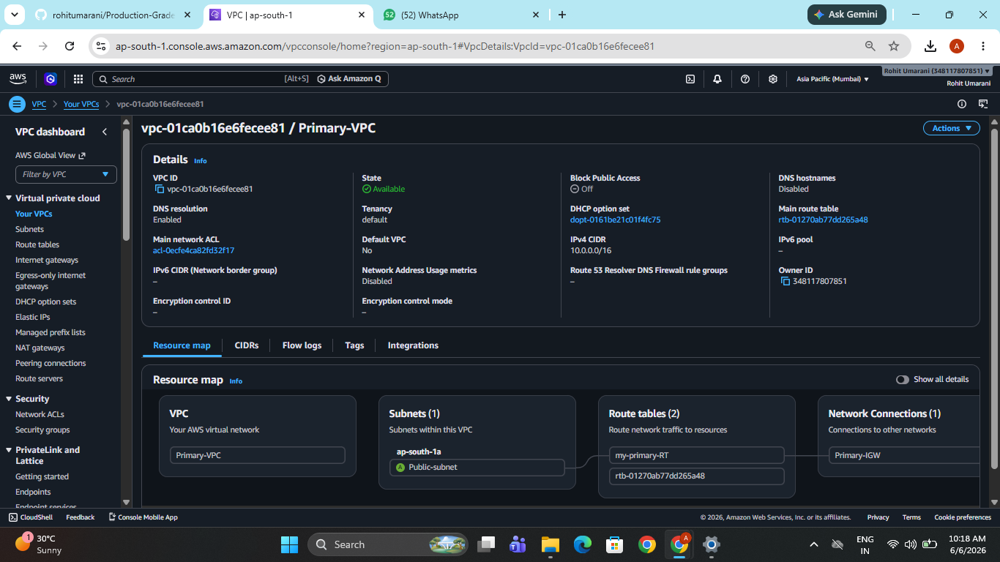
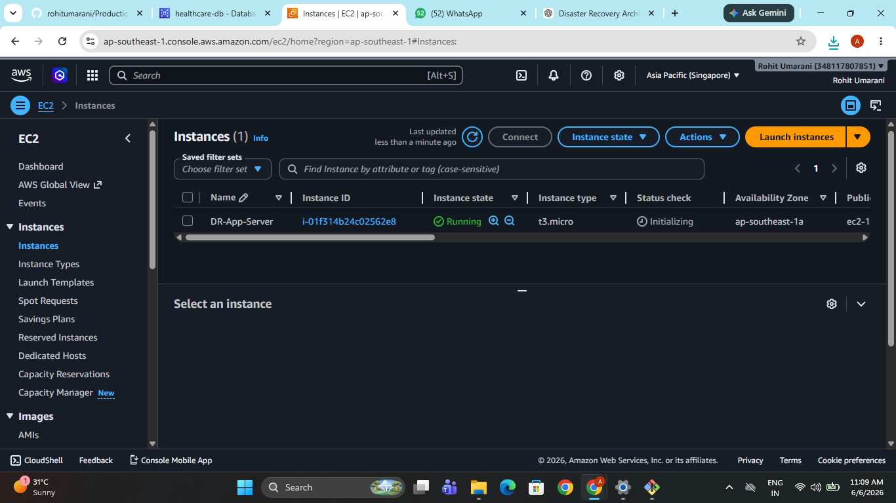

# 🌍 AWS Disaster Recovery Architecture with Cross-Region Replication and Automated Failover

## 📌 Project Overview

This project demonstrates a **production-grade Disaster Recovery (DR) architecture on AWS** designed to ensure **high availability, minimal downtime, and data protection**.

In many organizations, if the **primary AWS region fails**, the entire application becomes unavailable.
This project solves that problem by implementing a **cross-region disaster recovery solution**.

The architecture ensures that if the **primary region goes down**, the application automatically or manually fails over to a **secondary AWS region** with minimal downtime and near-zero data loss.

---

# 🏗 Architecture Diagram

Primary Region → Hosts the main application and database
Secondary Region → Acts as the Disaster Recovery (DR) environment

---

# ☁ AWS Services Used

| Service  | Purpose                     |
| -------- | --------------------------- |
| EC2      | Application server          |
| RDS      | Managed relational database |
| S3       | Object storage and backups  |
| Route 53 | DNS routing and failover    |
| IAM      | Access and permissions      |
| VPC      | Network infrastructure      |

---

# 🏢 Primary Infrastructure Setup

The primary AWS region hosts the main production infrastructure.

Components deployed:

• VPC (Virtual Private Cloud)
• Public subnet
• Internet Gateway
• Route tables

Application layer:

• EC2 instance hosting web application
• Security groups configured for HTTP/SSH access

Database layer:

• Amazon RDS MySQL database
• Connected with EC2 application server

Storage layer:

• S3 bucket for file storage
• Versioning enabled for replication support

---

# 🌍 Cross Region Replication Setup

## S3 Cross Region Replication

S3 replication ensures that data stored in the primary region is automatically copied to the DR region.

Steps performed:

1. Enabled **versioning** on both S3 buckets
2. Created **destination bucket** in secondary region
3. Configured **replication rule**
4. Attached **IAM replication role**

Result:

Any object uploaded to the **primary bucket** is automatically replicated to the **secondary bucket**.

---

## RDS Read Replica

To ensure database availability, an **RDS Read Replica** was created in a secondary region.

Features:

• Near real-time replication
• Read-only copy of the database
• Can be promoted to primary during disaster

Steps:

1. Enabled automated backups on primary RDS
2. Created cross-region read replica
3. Verified replication status

Result:

Secondary region always maintains an **updated copy of the database**.

---

# 🚨 Disaster Simulation

To validate the disaster recovery setup, a failure scenario was simulated.

Simulation steps:

1. Stopped EC2 instance in the primary region
2. Disabled primary RDS database
3. Promoted RDS Read Replica to Primary
4. Launched EC2 instance in secondary region
5. Deployed application connected to promoted database

Result:

Application successfully ran from the **secondary DR region**.

---

# 🔁 Failover Strategy

## Manual Failover

Steps:

1. Detect failure in primary region
2. Promote RDS read replica
3. Launch EC2 instance in DR region
4. Update Route 53 DNS record
5. Redirect traffic to DR region

---

## Automated Failover (Recommended)

Automated failover can be implemented using:

• Route 53 Health Checks
• CloudWatch monitoring
• Lambda automation

When the primary endpoint becomes unhealthy, traffic automatically redirects to the **secondary region**.

---

# ⏱ RTO and RPO Strategy

| Metric | Description              | Value        |
| ------ | ------------------------ | ------------ |
| RTO    | Recovery Time Objective  | 5–10 Minutes |
| RPO    | Recovery Point Objective | Near Zero    |

Explanation:

RTO refers to the maximum acceptable time the system can remain unavailable.

RPO refers to the maximum acceptable amount of data loss measured in time.

Because of **RDS replication and S3 cross-region replication**, the data loss is extremely minimal.

---

# 📸 Project Screenshots

## EC2 Primary Server Running

---

---

## RDS Primary Database

---

## RDS Read Replica

---

## S3 Cross Region Replication

---

## Route 53 Failover Configuration

---

## Primary VPC

---

## Failover Success (Application Running in DR Region)

---

# 📊 Disaster Recovery Strategy Comparison

| Strategy          | Cost   | Recovery Time | Data Loss |
| ----------------- | ------ | ------------- | --------- |
| Backup & Restore  | Low    | High          | High      |
| Pilot Light       | Medium | Medium        | Low       |
| Warm Standby      | Medium | Low           | Very Low  |
| Multi-Site Active | High   | Very Low      | Near Zero |

This project implements the **Warm Standby Disaster Recovery Strategy**.

---

# 📁 GitHub Project Structure

aws-disaster-recovery-project

architecture/
dr-architecture.png

screenshots/
ec2-primary-running.png
rds-primary.png
rds-read-replica.png
s3-replication.png
route53-failover.png
disaster-simulation.png
failover-success.png

application/
simple-web-app-code

README.md

---

# 📚 Lessons Learned

• Importance of multi-region architecture
• Disaster recovery planning in cloud environments
• S3 cross-region replication setup
• RDS read replica configuration and promotion
• DNS failover using Route 53
• Disaster recovery validation testing

---

# 👨‍💻 Author

**Rohit Umarani**

Cloud & DevOps Enthusiast
AWS | Terraform | Linux | CI/CD
